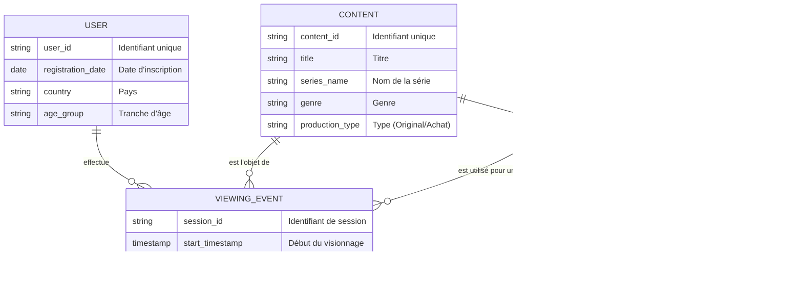
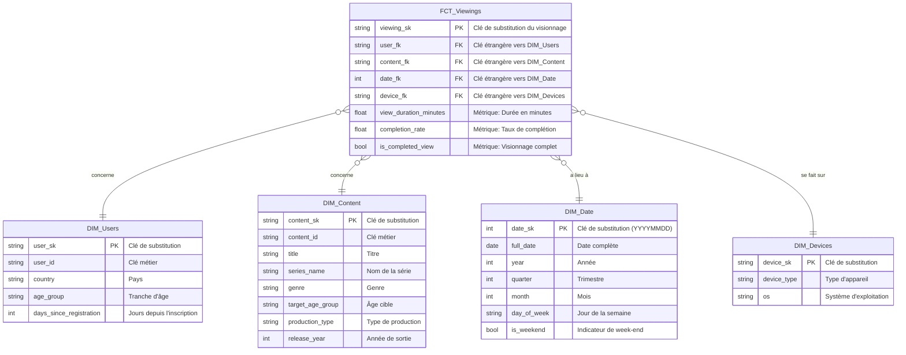

# Modèles de Données (MCD & MPD)

Ce document présente le Modèle Conceptuel de Données (MCD) et le Modèle Physique de Données (MPD) pour la plateforme Big Data de BigMedia, représentés à l'aide de diagrammes Mermaid.

## 1. Modèle Conceptuel de Données (MCD)

Le MCD représente les entités métiers principales et leurs relations logiques. Il se concentre sur la sémantique des données avant toute considération technique.

## 2. Modèle Physique de Données (MPD) - Schéma en Étoile

Le MPD décrit la structure physique des tables dans la base de données (Google BigQuery). Il est optimisé pour l'analyse décisionnelle (BI) et suit un modèle en étoile.

*   **Table de Faits (`FCT_Viewings`)** : Contient les métriques à analyser (ex: durée de visionnage).
*   **Tables de Dimensions (`DIM_*`)** : Contiennent les axes d'analyse (ex: utilisateur, contenu, temps).

